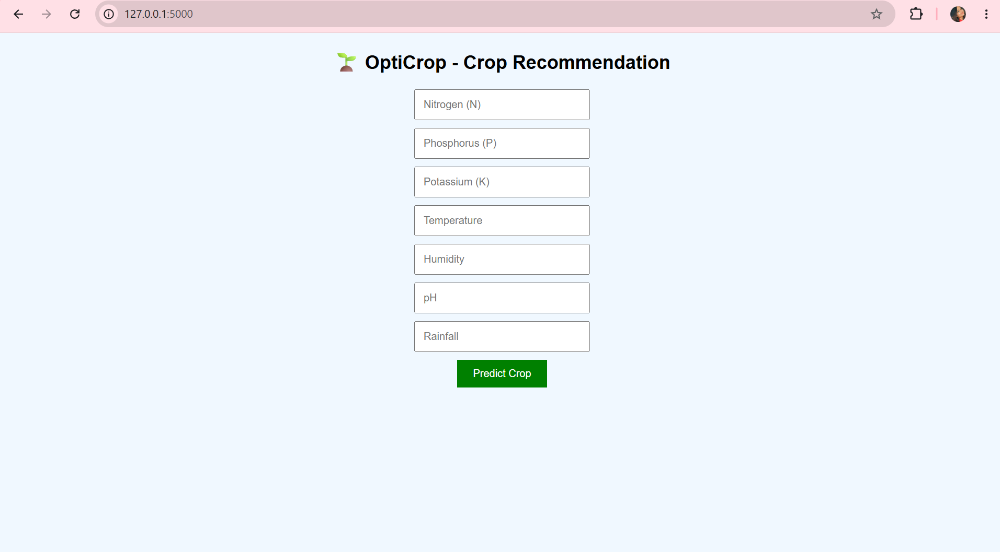
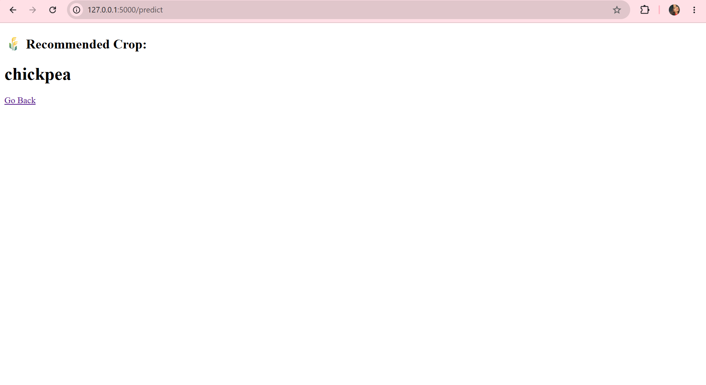
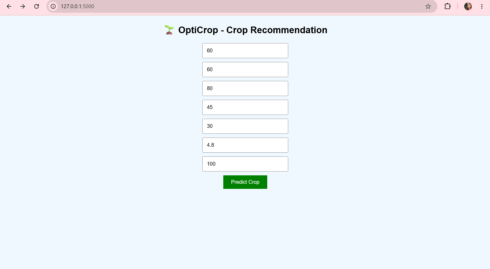

# 🌱 OptiCrop – Smart Crop Recommendation System

OptiCrop is a Machine Learning-based web application that helps farmers and agricultural enthusiasts choose the best crop to grow based on environmental conditions such as soil nutrients, temperature, humidity, and rainfall.

This project leverages data-driven insights to improve agricultural productivity and promote sustainable farming practices.

---

## 🚀 Features

* 🌾 Crop recommendation based on soil and climate data
* 🤖 Machine Learning-powered predictions
* 📊 User-friendly interface for input and results
* ⚡ Fast and accurate predictions
* 🌍 Supports sustainable agriculture decisions

---

## 🧠 Machine Learning Overview

OptiCrop uses supervised machine learning algorithms trained on agricultural datasets.

### Workflow:

1. Data Collection (soil nutrients, weather conditions)
2. Data Preprocessing
3. Model Training (e.g., Random Forest / Decision Tree)
4. Model Evaluation
5. Prediction using trained model (`model.pkl`)

The model predicts the most suitable crop based on input features.

---

## 🛠️ Tech Stack

* **Frontend:** HTML, CSS
* **Backend:** Python (Flask)
* **Machine Learning:** Scikit-learn, Pandas, NumPy
* **Visualization:** Matplotlib / Seaborn
* **Deployment:** Localhost / GitHub

---

## 🧰 Development Tools

* VS Code / PyCharm
* Jupyter Notebook
* Git & GitHub
* Python 3.x

---

## 📂 Project Structure

```
OptiCrop/
│── static/              # CSS, images
│── templates/           # HTML files
│── assets/              # Screenshots
│── model.pkl            # Trained ML model
│── app.py               # Flask application
│── train_model.py       # Model training script
│── requirements.txt     # Dependencies
│── README.md            # Documentation
```

---

## ⚙️ Installation & Setup

### 1. Clone the repository

```bash
git clone https://github.com/mothisritha11/OptiCrop.git
cd OptiCrop
```

### 2. Create virtual environment (optional)

```bash
python -m venv venv
venv\Scripts\activate   # Windows
```

### 3. Install dependencies

```bash
pip install -r requirements.txt
```

### 4. Run the application

```bash
python app.py
```

### 5. Open in browser

```
http://127.0.0.1:5000/
```

---

## 🖼️ Screenshots

### Home Page


### Prediction Result


### Input Form

---

## 🔮 Future Scope

* 🌐 Deploy on cloud (AWS / Heroku)
* 📱 Mobile application integration
* 🌦️ Real-time weather API integration
* 🧠 Advanced ML/DL models for higher accuracy
* 🌍 Multi-language support for farmers

---

## 🎓 Internship Relevance

This project demonstrates:

* Real-world Machine Learning application
* Full-stack development skills
* Data analysis and model building
* Problem-solving in agriculture domain

Suitable for AI/ML, Data Science, and Web Development internships.

---

## 🤝 Contributing

Contributions are welcome!

1. Fork the repository
2. Create a new branch
3. Make your changes
4. Commit and push
5. Open a Pull Request

---

## 📜 License

This project is licensed under the MIT License.

---

## 📞 Contact

👩‍💻 **Name:** Mothi Sritha
📧 **Email:** [your-email@example.com](mailto:your-email@example.com)
🔗 **GitHub:** https://github.com/mothisritha11

---

## ⭐ Support

If you like this project, give it a ⭐ on GitHub!

