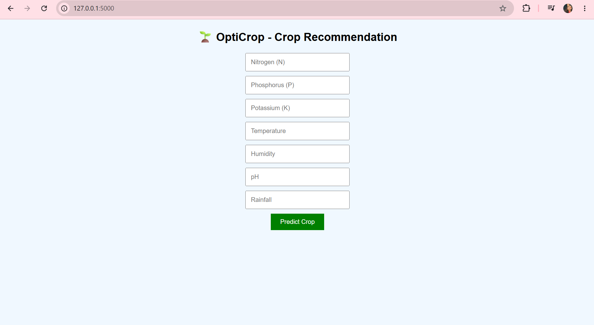
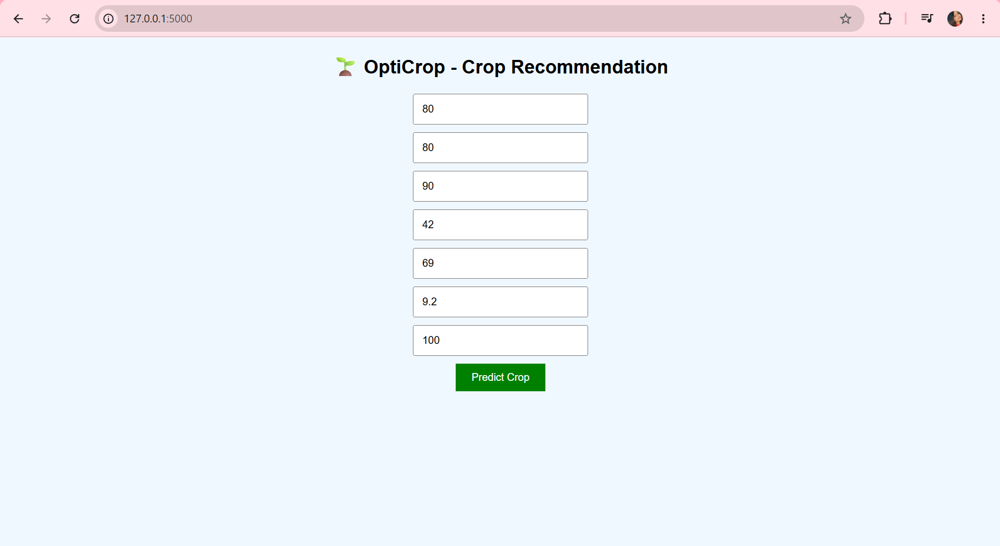

# 🌱 OptiCrop: Smart Crop Recommendation System

## 📌 Project Overview

OptiCrop is a Machine Learning-based web application designed to recommend the most suitable crops for cultivation based on environmental and soil conditions. This system helps farmers and agricultural planners make data-driven decisions to improve crop yield and sustainability.

---

## 🎯 Objective

The main objective of this project is to:

* Predict the best crop to grow based on input parameters
* Improve agricultural productivity using AI
* Assist farmers in making informed decisions

---

## 🚀 Features

* 🌾 Crop recommendation using Machine Learning
* 📊 User-friendly interface for input parameters
* ⚡ Fast and accurate predictions
* 📈 Based on real-world agricultural data
* 💻 Easy to use and deploy

---

## 🛠️ Tech Stack

### Frontend

* HTML
* CSS

### Backend

* Python
* Flask

### Machine Learning

* Scikit-learn
* Pandas
* NumPy

### Tools

* VS Code
* Git & GitHub
* Jupyter Notebook

---

## 📁 Project Structure

```
OptiCrop/
│── dataset/              # Dataset used for training
│── model/                # Saved ML model (model.pkl)
│── static/               # CSS, JS, images
│── templates/            # HTML files
│── src/                  # Source code files
│── app.py                # Main Flask application
│── requirements.txt      # Dependencies
│── README.md             # Project documentation
```
## 📸 Screenshots


### 🏠 Home Page





### 🌱 Crop Prediction Input





### 📊 Prediction Result


## ⚙️ Installation & Setup

### Step 1: Clone the Repository

```
git clone https://github.com/mothisritha11/OptiCrop.git
cd OptiCrop
```

### Step 2: Install Dependencies

```
pip install -r requirements.txt
```

### Step 3: Run the Application

```
python app.py
```

### Step 4: Open in Browser

```
http://127.0.0.1:5000/
```
## 🤖 Machine Learning Overview

* The model is trained using supervised learning algorithms
* Input features include:

  * Nitrogen (N)
  * Phosphorus (P)
  * Potassium (K)
  * Temperature
  * Humidity
  * pH value
  * Rainfall
* The model predicts the most suitable crop for the given conditions
* Model is saved as `model.pkl` using pickle

---

## 📊 Workflow

1. User inputs soil and environmental data
2. Data is processed by backend (Flask)
3. ML model predicts the best crop
4. Result is displayed on the webpage

---

## 🔮 Future Scope

* 🌐 Deploy the project online (AWS/Heroku)
* 📱 Mobile application integration
* 🌍 Add real-time weather API
* 📊 Improve model accuracy using deep learning
* 🗺️ Location-based crop suggestions

---

## 🧰 Development Tools

* Visual Studio Code
* Jupyter Notebook
* GitHub Version Control

---

## 🎓 Internship Relevance

This project demonstrates:

* Practical implementation of Machine Learning
* Full-stack development skills
* Problem-solving in agriculture domain
* Real-world application of AI

---

## 🤝 Contributing

Contributions are welcome!

Steps:

1. Fork the repository
2. Create a new branch
3. Make your changes
4. Commit and push
5. Create a Pull Request

---

## 📜 License

This project is licensed under the MIT License.

---

## 📞 Contact

**Name:** Mothi Sritha
**GitHub:** https://github.com/mothisritha11

---

⭐ If you found this project useful, give it a star!

